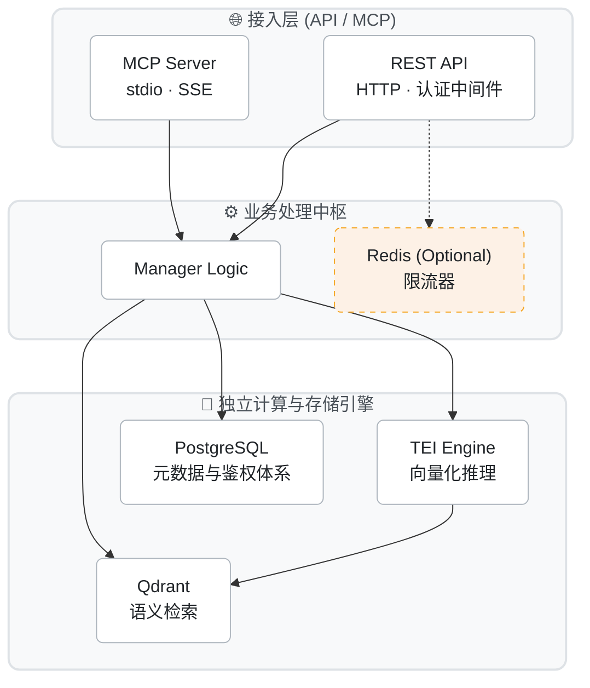

<p align="center">
  <h1 align="center">🧠 Engrama</h1>
  <p align="center"><strong>通用 AI 记忆中间件（Memory-as-a-Service）</strong></p>
  <p align="center">为各类 AI 项目提供「按渠道接入、按用户隔离」的记忆存储与语义检索服务</p>
</p>

<p align="center">
  <a href="#-什么是-engrama">关于项目</a> ·
  <a href="#-快速开始">快速开始</a> ·
  <a href="#-架构与集成">架构集成</a> ·
  <a href="./TUTORIAL-how-to.md">📖 操作指南 (Tutorials)</a>
</p>

---

## ✨ 什么是 Engrama

Engrama 是一个**轻量级、通用的 AI 记忆中间件**，解决 AI 项目中的一个核心痛点：**如何让 AI 记住用户**。

- 🔌 **即插即用** — 3 行代码接入，标准 REST API 与原生 MCP 支持。
- 💰 **零 LLM 成本** — 基础的数据储取、分类、搜索与关联不消耗任何大模型 Token 成本。
- 🔒 **三层隔离** — Tenant → Project → User，数据天然隔离与强鉴权防护。
- 🔍 **语义搜索** — 依托独立高能的 TEI 引擎与 Qdrant 向量库，理解长文本语义意图搜索。
- 📦 **自部署** — 容器化编排设计，一键完全私有化部署。

## 📚 文档指南 (Diátaxis)

本项目采用现代的 [Diátaxis](https://diataxis.fr/) 文档架构规范：
* **[快速开始 (本页面)](#-快速开始)**：介绍、搭建和启动项目。
* **[使用教程 (How-to Guides)](./TUTORIAL-how-to.md)**：包含 REST API 渠道打通、MCP 集成 AI、隔离机制以及如何安全地执行隔离测试等落地指导。

---

## 🚀 快速开始

### 1. 环境准备与代码拉取
你需要在机器上安装：Python (3.11-3.13), Docker 与 Docker Compose。

```bash
git clone https://github.com/wok0088/engrama.git
cd engrama

# 初始化 Python 虚拟环境与依赖
python3.12 -m venv .venv
source .venv/bin/activate
pip install -r requirements.txt
```

### 2. 配置环境变量
项目强制采用 `.env` 接管配置，不再支持硬编码。
```bash
# 复制标准模板
cp .env.example .env

# 编辑 .env 文件
# ！！！请务必手动在 .env 中设定非常复杂的 ENGRAMA_ADMIN_TOKEN 与数据库密码等信息。
vim .env
```

### 3. 一键部署基座依赖 (Qdrant + PgSQL + Redis + TEI)
```bash
# 借助 Docker 编排拉起所有后端引擎（默认后台常驻）
docker-compose up --build -d
```

### 4. 启动 Engrama 核心层
```bash
uvicorn api.main:app --reload

# 🎉 随后你可以在浏览器访问 http://localhost:8000/docs
# 即可直接唤出 FastAPI 的丝滑交互式 API 调试文档！
```

---

## 🏗️ 架构与集成



### 接入指引
- 需要将 Engrama 赋能给你的**传统业务代码**：使用 [REST API 接口文档](http://localhost:8000/docs)。
- 需要将 Engrama 赋能给你的 **AI Agent (Cursor/Claude)**：请跳转至 [MCP 接入教程](./TUTORIAL-how-to.md#2-如何通过-mcp-接入-ai-助手)。

---

## 🛠 开发与测试
测试环境受严格的安全锁机制保护，绝不允许错连污染。请复制 `.env.example.test` 创建隔离的测试环境后再执行如下指令：

```bash
# 执行单元用例
ENGRAMA_ENV=test pytest
```

## 📄 License & Contributing
依据 [MIT License](./LICENSE) 开放源代码。欢迎提交 Issue 与 Pull Request！
